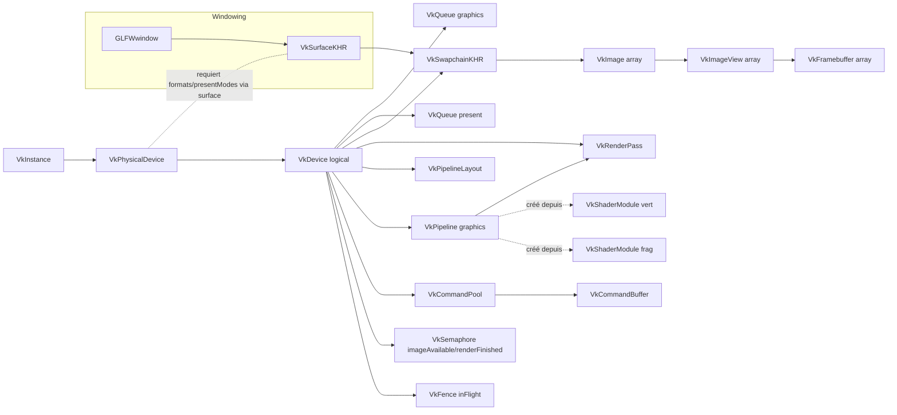
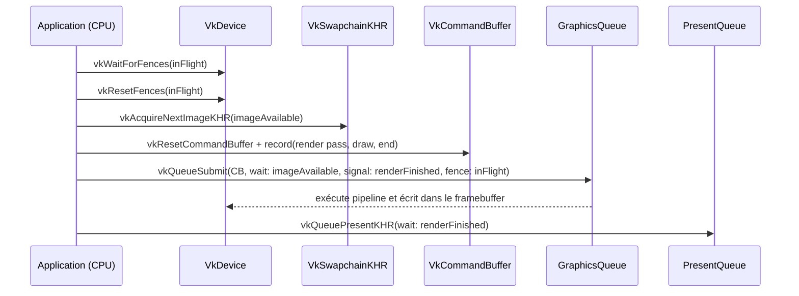

# Vulkan Tutorial — Architecture & Frame Flow

Ce document décrit l’architecture des objets Vulkan de l’application et le flux d’exécution d’une frame. Les diagrammes sont au format Mermaid.

> Astuce VS Code: installe l’extension “Markdown Preview Mermaid Support” pour prévisualiser les diagrammes.

## Architecture des objets

Notes:
- GLFW crée la fenêtre et la surface (`VkSurfaceKHR`).
- L’instance → GPU physique → device logique → queues (graphics/present).
- Surface + device → swapchain; images → image views → framebuffers.
- Render pass + pipeline layout → graphics pipeline (les shader modules sont détruits après création).
- Command pool/buffer pour l’enregistrement des commandes.
- Sémaphores et fence pour la synchronisation.

## Flux d’une frame

## Liens avec le code
- Création window/surface: `initWindow()`, `createSurface()`
- Instance/device/queues: `createInstance()`, `pickPhysicalDevice()`, `createLogicalDevice()`
- Swapchain: `createSwapChain()`, `createImageView()`
- Render pass & pipeline: `createRenderPass()`, `createGraphicsPipeline()`
- Framebuffers: `createFrameBuffers()`
- Commandes: `createCommandPool()`, `createCommandBuffer()`, `recordCommandBuffer()`
- Sync: `createSyncObjects()`, `drawFrame()`
